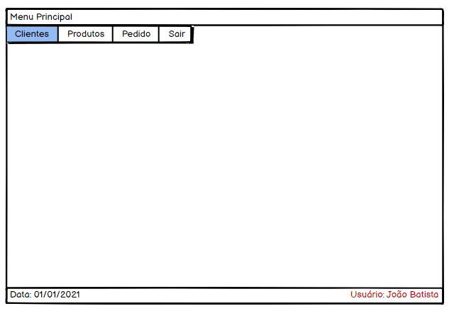
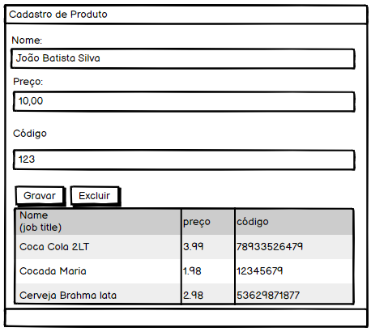
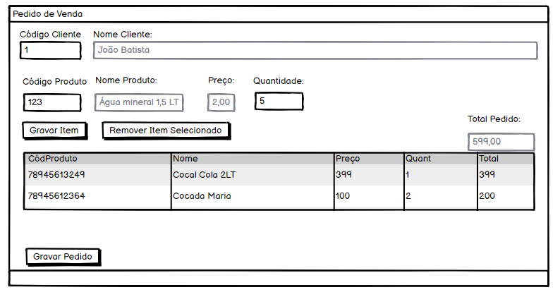

<h3 align="center">
  Teste Analista Desenvolvedor - Desktop
</h3>

<blockquote align="center">“Não espere para plantar, apenas tenha paciência para colher”!</blockquote>

  

  

  

  <a href="#rocket-sobre-o-desafio">Sobre o desafio</a>&nbsp;&nbsp;&nbsp;|&nbsp;&nbsp;&nbsp;
  <a href="#calendar-entrega">Entrega</a>&nbsp;&nbsp;&nbsp;|&nbsp;&nbsp;&nbsp;
  <a href="#memo-licença">Licença</a>

## :rocket: Sobre o desafio

Nesse teste, você deve criar uma aplicação para atestar aquilo que foi discutido nas entrevistas.

Utilize a linguagem de programação que julgue ter mais domínio, para produção do resultado final.

Porém, as linguagens que serão melhores avaliadas pela Linear serão: 
 - </img>
 - </img>
 - </img>
 - </img>
 - </img>

## Style Guide Linguagens
 - <a href="https://github.com/acessolinear/visual-basic-6-style-guide">Visual Basic 6</a>
 - <a href="https://github.com/acessolinear/csharp-style-guide">CSharp</a>
 - <a href="https://github.com/acessolinear/java-style-guide">Java</a>
 - <a href="https://github.com/acessolinear/node-style-guide">Nodejs</a>
 
O banco de dados a ser utilizado, precisa ser o </img>. Você pode baixa-lo no link abaixo.
(https://dev.mysql.com/downloads/windows/installer/5.7.html)

Para avaliar as habilidades do(a) candidato(a) à vaga de Analista Desenvolvedor, será necessário que o mesmo implemente um projeto com um CRUD de pedidos de venda.

O projeto deve compreender uma interface gráfica para um simples sistema de pedidos de venda contendo:
 - LOGIN

  

 - MENU PRINCIPAL
 
 

  

 - CADASTRO DE CLIENTE

  

 - CADASTRO DE PRODUTO

  

 - CADASTRO DE PEDIDO DE VENDA

  

## Regras de Negócio

Leia com atenção todas as regras a serem implementadas  🤓. 

Tente ter uma visão objetiva do desenvolvimento da aplicação, começando sempre pelas entidades que não possuem dependência composta. (A tela de Pedido de Venda depende de clientes e produtos, portanto, deve ser a ultima a ser implementada. 😉).

Para logar na aplicação, adicione manualmente o usuário no banco de dados, utilizando alguma ferramenta de gerenciamento de scripts SQL's. 

Neste link sugerimos uma bem legal 😍

(https://www.heidisql.com/download.php)

## Login

 - RN1: Não deve permitir logar com um usuário que não esteja cadastrado no banco de dados.
  
## Menu Principal

 - RN1: Deve-se apresentar no formulário, a data corrente de login e o nome do usuário logado. Sugerimos no rodapé, conforme mockup da tela.

## Cadastro de Clientes

 - RN1: Não permitir excluir um cliente que esteja referenciado em uma venda.

 - RN2: Não permitir gravar um cliente sem o valor de limite de crédito, ou limite 0.

## Cadastro de Produtos

 - RN1: Não permitir gravar produtos sem o código, ou com código zerado.

 - RN2: Não permitir gravar produtos sem o preço, ou com preço zerado.
  
## Cadastro de Pedido de Venda

 - RN1: Não permitir gravar pedido para clientes cujo o valor do limite, ultrapasse o do cadastro de cliente.

 - RN2: Ao gravar um pedido, deve-se abater o valor total do pedido, do limite de crédito do cliente.

 - RN3: Não permitir inserção de produtos com preço de venda zerados.

Se dividirmos semanticamente as responsabilidades da nossa aplicação em entidades, considere separar as regras de negócio, da camada de visão.

Caso não esteja familiarizado com o MVC, considere uma leitura 📘 no link para se embasar melhor.

(https://www.devmedia.com.br/introducao-ao-padrao-mvc/29308)

### Requisitos desejáveis, não obrigatórios, mas que serão levado em consideração para critério de desempate  👏👏
 - Produza pelo menos dois diagramas UML de preferência sobre qualquer parte da aplicação. (Caso esteja perdido em qual 😂, sugerimos o diagrama de Caso de Uso e Diagrama de Sequência).
 - Produza o Modelo de entidade-relacionamento do banco de dados (DER).
 - Produza testes automatizados da sua aplicação.

Bons estudos <3

## :calendar: Entrega

🥇 Após concluir a execução do teste, grave um pequeno video (Pode ser o próprio celular filmando a tela do PC) mostrando a aplicação em funcionamento e uma breve explicação do código e sua estrutura. 😁

Sinta-se a vontade para escolher qual plataforma deseja compartilhar o link do vídeo 📼. Sugerimos GoogleDrive ou OneDrive. 

Esse desafio deve ser entregue por email (respondendo o e-mail enviado pela linear), na qual ele deve conter o link do seu repositório do Git Hub, com o projeto.

Não se esqueça de montar um arquivo README.MD incrível para apresentação do seu projeto, nos explicando as tecnologias usadas, dependências do projeto e principalmente como subir a sua aplicação (script do banco sql por exemplo). 😉

## :memo: Licença

Esse projeto está sob a licença MIT. Veja o arquivo [LICENSE](./LICENSE) para mais detalhes.

---

Feito com 💜 by Linear Sistemas :wave:
